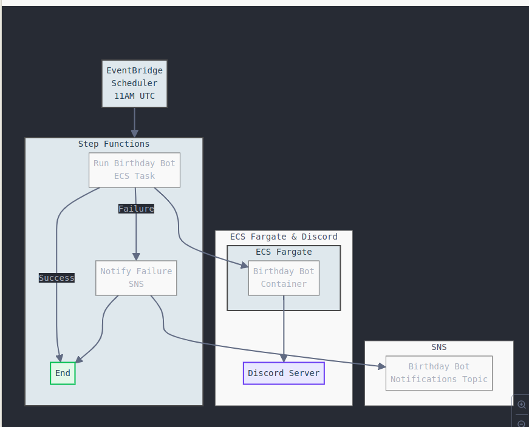
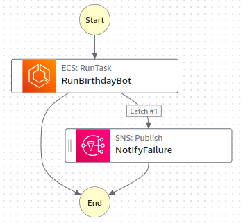

# Discord Birthday Bot 🎂
A Discord bot that automatically sends birthday wishes and GIFs to server members on their birthdays.

## Requirements
- Python 3.11
- Poetry 1.8.3
- Docker

Ubuntu 24.04 was used as the OS for the dev environment. 

## Project Structure
```
.
├── main.py         # Bot implementation
├── settings.py     # Configuration settings
├── poetry.lock     # Poetry dependency lock file
├── pyproject.toml  # Poetry project configuration
├── Dockerfile      # Docker image configuration
└── compose.yaml  # Docker Compose configuration
```

## Installation

### Using Poetry
```bash
poetry install --no-root
```

### Using Docker
```bash
docker-compose up -d
```

## Configuration
Create a `.env` file in the project root with the following variables:
```
DISCORD_TOKEN=your_discord_bot_token
CHANNEL_ID=your_channel_id
HEARTBEAT_CHANNEL_ID=your_heartbeat_channel_id
TENOR_API_KEY=your_tenor_api_key
TENOR_QUERY=birthday+dance    # Search query for Tenor GIFs
CLAUDE_API_KEY=your_claude_api_key
CLAUDE_MODEL=claude-3-sonnet-20240229
DATA_PATH=path_to_birthdays_data    # Local file path or S3 URI to birthday csv (see Birthday Data section below)
CLAUDE_PROMPT_PATH=path_to_txt_file_with_prompt    # Local file path or S3 URI to prompt file (see Prompt Configuration section below)
```

## Birthday Data
The bot reads birthday data from a CSV file specified by the `DATA_PATH` environment variable. The file can be stored locally or in an S3 bucket. The CSV should have the following structure:
```csv
username,birthday
user123,1990-01-15
johndoe,1995-07-30
```

The columns are:
- `username`: Discord username
- `birthday`: Birthday in YYYY-MM-DD format

## Prompt Configuration
The bot uses a prompt template specified by the `CLAUDE_PROMPT_PATH` environment variable to generate birthday messages. This file can be stored locally or in an S3 bucket. The prompt file contains the template text that Claude will use to generate unique birthday messages for each user.

Example prompt template:

```
Generate a mean birthday message with emojis. Make it playfully insulting but not offensive. Always start with Happy Birthday!
        Good examples:
        "🎂 Happy Birthday! Another year older, still can't dress yourself! 👴"
        "🎈 Happy Birthday! Your age is now approaching your IQ - congratulations on the improvement! 🤓"
        Bad examples:
        Here's a funny birthday message: "Happy birthday to someone who..."
        "A birthday message for you: Getting older but not wiser..."
        "I've generated this birthday wish: Age is just a number..."
        Generate only the message text without any introductory or closing phrases.
```

## Running the Bot

### Using Poetry
```bash
poetry run python main.py
```

### Using Docker
The bot can be run using Docker in two ways:

1. Using Docker Compose (recommended):
```bash
docker-compose up -d
```

2. Using Docker directly:
```bash
docker build -t birthday-bot .
docker run --env-file .env birthday-bot
```

The bot will:
1. Check for birthdays in the configured data source
2. Send a GIF and AI-generated birthday message for each celebrant
3. Automatically shut down after processing birthdays

## Docker Configuration Notes
- The Docker setup uses a secure multi-stage build to minimise the final image size and make it more secure
- The bot runs as a non-root user inside the container for security
- AWS credentials for S3 access can be provided through:
  - Environment variables (AWS_ACCESS_KEY_ID, AWS_SECRET_ACCESS_KEY)
  - IAM roles when running on AWS infrastructure
  - Mount points specified in compose.yaml
- Local files can be mounted using volumes in compose.yml

## Architecture


The bot is deployed on AWS using:
- EventBridge Scheduler: Triggers the bot daily at 11 AM UTC
- Step Functions: Orchestrates the execution flow and handles failures
- ECS Fargate: Runs the bot in a containerised environment
- SNS: Handles failure notifications
- Discord API: Sends birthday messages to the configured channel

The bot runs as a containerised application that:
1. Reads birthday data from the configured source
2. Generates unique messages using Claude
3. Fetches celebration GIFs from Tenor 
4. Posts the birthday wishes to Discord



The Step Functions workflow is straightforward - it attempts to run the birthday bot container with built-in retry logic and exponential backoff, and if it still fails after retries, it publishes a notification to SNS. This ensures we're aware of any persistent issues with the bot's execution.

While the bot could be run more simply using local crontab on Unix-like systems, this over-engineered AWS architecture was chosen for fun and as a learning exercise in cloud services! The AWS deployment does provide better reliability, monitoring, and error handling through its managed services.

## To Do Next
Future improvements planned for this project:
- Implement unit tests and integration tests
- Enable Dependabot for automated dependency updates
- Improve CI/CD workflow:
    - Add test automation
    - Add code quality checks
    - Implement automated security scanning
    - Add automated build and deployment validation
